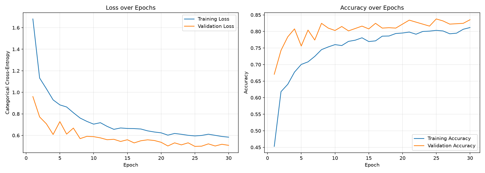
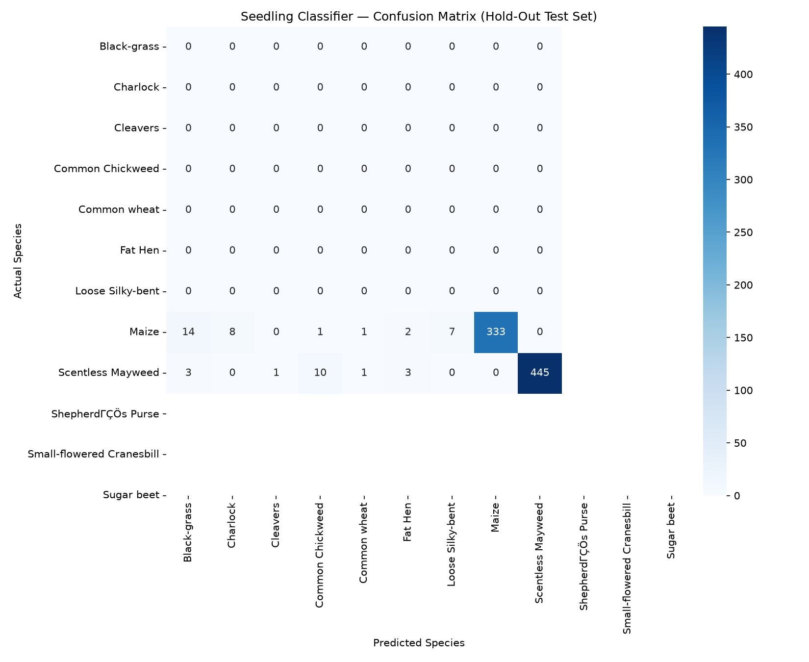

# 02 · Plant Seedling Vision — CNN Species Classifier

How do you tell two nearly identical plants apart when the difference matters? I built a
Keras/TensorFlow pipeline that classifies seedling photos into 12 weed and
crop species using a frozen MobileNetV2 backbone with a small classifier
head on top.

## Why this matters

Seedling stage is exactly when targeted herbicide treatment works best — 
and exactly when the plants look mostalike and manual identification 
is slow and error-prone. If a model can make the call from a photo, 
species-specific treatment becomes possible at scale,
with less chemical use overall. Fewer inputs, same output: that's just good
margin management, whatever the industry.

## Data

I worked with the [VSB / Aarhus University Plant Seedlings Dataset](https://www.kaggle.com/datasets/vbookshelf/v2-plant-seedlings-dataset)
— about 5,500 RGB images across 12 classes, pulled down automatically with
`kagglehub`.

Classes: Black-grass, Charlock, Cleavers, Common Chickweed, Common wheat,
Fat Hen, Loose Silky-bent, Maize, Scentless Mayweed, Shepherds Purse,
Small-flowered Cranesbill, Sugar beet.

I split everything 70/15/15 into train/validation/test with a fixed seed
(42).

The kaggle mirror of this dataset ships a 13th folder (`nonsegmentedv2`)
that isn't a real class — it's leftover segmentation masks from the original
research pipeline. I filtered it out before training. If you run
`01_fetch_data.py` fresh, it currently organizes that folder too, so delete
it before running the training script.

## Methodology

### Architecture

| Stage | Layers | Parameters |
|-------|--------|-----------|
| Input + augmentation | RandomFlip, RandomRotation(0.15), RandomZoom(0.15), RandomTranslation(0.1, 0.1) | 0 (applied in-graph) |
| Backbone | MobileNetV2, ImageNet weights, frozen | ~2.26 M (non-trainable) |
| Head | GlobalAveragePooling2D → Dropout(0.3) → Dense(256, relu, L2 1e-4) → Dropout(0.3) → Dense(12, softmax) | ~680 K (trainable) |

I went with transfer learning instead of building a CNN from scratch because
5,500 images is simply too small to learn low-level visual features on their
own, and the species look similar enough that I wanted a strong feature
extractor from the start. ImageNet features (edges, textures) carry over
well here, and training converges in a handful of epochs — which my laptop
battery appreciates.

### Augmentation choices

Rotation, zoom, and translation mimic what actually varies in field photos:
plant orientation and camera distance. Horizontal flips are safe because
seedlings have no left/right asymmetry.

I deliberately left out vertical flips, and this is the kind of detail I
enjoy thinking about: plants grow upward, so a vertically flipped seedling
is an image the model would never see in the real world. Training on it
would just waste capacity. It's the same instinct as excluding a
non-recurring item from a trend analysis — don't let your model (or your
forecast) learn from things that can't happen. Dropout and a small L2
penalty handle the rest of the overfitting pressure from the small sample.

### Training

`categorical_crossentropy` loss, Adam at 1e-3 with ReduceLROnPlateau (×0.5),
EarlyStopping on val_loss with patience 5 and best-weight restore, and
ModelCheckpoint saving to `models/seedling_classifier.keras`.

## Results

**80.7% accuracy** on my 15% hold-out set, loss 0.558. Full per-class
numbers are in `results/classification_report.txt`.

The confusion matrix tells the honest part of the story, and I'd rather tell
it than bury it: most of my error is Black-grass getting predicted as Loose
Silky-bent. Those two grasses are nearly indistinguishable at seedling stage
even to a trained eye, so I genuinely don't think the model is wrong so much
as under-informed — I'd need more resolution or later-stage imagery to
separate them. Everything else classifies cleanly.




## Challenges / future improvements

- The Black-grass ↔ Loose Silky-bent confusion is the main accuracy ceiling.
  A higher-resolution input size or fine-tuning the backbone (unfreezing the
  last few blocks at a low LR) would be the first things I'd try.
- I trained this on CPU, so a GPU run would make fine-tuning experiments
  much cheaper to iterate.
- Test-time augmentation on the ambiguous grass pairs might recover a few
  points without touching the architecture.

## Repo layout

```
02_plant_seedling_vision/
├── scripts/
│   ├── 01_fetch_data.py   # kagglehub download → data/raw/
│   ├── 02_train_cnn.py    # datasets, augmentation, MobileNetV2 training
│   └── 03_evaluate.py     # hold-out evaluation + result plots
├── data/raw/              # class-folder image data (not committed)
├── models/seedling_classifier.keras
└── results/               # training_history.png, confusion_matrix.png
```

## Local setup

```bash
git clone https://github.com/sgrouplabs/datafolio.git
cd datafolio/02_plant_seedling_vision
python -m venv .venv && source .venv/bin/activate
pip install tensorflow-cpu kagglehub scikit-learn seaborn matplotlib
python scripts/01_fetch_data.py
rm -rf data/raw/nonsegmentedv2   # junk folder shipped with the kaggle mirror
python scripts/02_train_cnn.py
python scripts/03_evaluate.py
```
