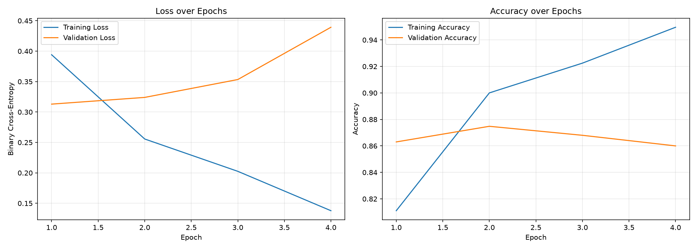
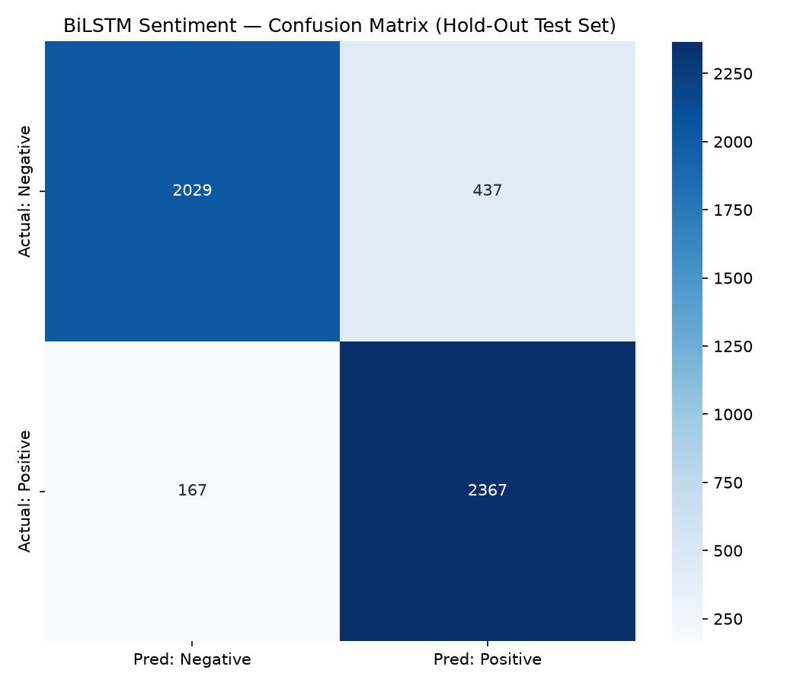

# 03 · NLP Sentiment Analysis — Bidirectional LSTM Classifier

This project was my way of tackling the opposite: unstructured text, where
the signal (reviews, tickets, social posts) has to be extracted before it
can be used for anything. I built a Keras/TensorFlow pipeline that
classifies movie reviews as positive or negative using a Bidirectional LSTM
over learned word embeddings.

## Why this matters

Sentiment is signal you simply cannot get from structured data — no ledger
tells you whether customers are *getting angrier*. I built the
core sequence-modeling stack: tokenization, padding, learned
embeddings, a recurrent encoder, all on the standard IMDb benchmark. 

## Data

I used the IMDb Large Movie Review Dataset via `tf.keras.datasets.imdb`:
50,000 reviews, pre-tokenized to the top 10,000 words. I shuffled everything
and split 80/10/10 into 40k train / 5k validation / 5k test with seed 42.
Class balance sits right around 50/50 - it means
accuracy is an honest metric here and I don't have to defend a weighted
one.

I padded/truncated reviews to a uniform `maxlen=250`. The mean review is
about 235 tokens but the 95th percentile is 599, so there was a judgment
call to make, and here's my reasoning: 250 covers most reviews in full and
keeps training fast, at the cost of truncating the tail. Longer reviews
still contribute their first 250 tokens, which in practice carry most of the
sentiment signal. It's the same trade-off I'd make cutting off a reconciliation
at materiality — perfection isn't free, and 250 is where the marginal token
stops paying for itself.

## Methodology

### Embedding strategy

| Layer | Config | Parameters |
|-------|--------|-----------|
| `Embedding` | input_dim=20,000 · output_dim=128 · `mask_zero=True` | ~2.56 M (learned) |
| `Bidirectional(LSTM)` | 64 units per direction → 128-d concatenated state | ~99 K |
| `Dropout` | 0.5 after LSTM, 0.3 after Dense(64) | — |
| `Dense` | 64 units, relu | ~8.3 K |
| `Dense` output | 1 unit, sigmoid | 65 |

I learned the embeddings from scratch rather than loading Word2Vec or GloVe.
With 40k training reviews there's enough signal to fit vectors tuned
specifically to sentiment, and it keeps the pipeline self-contained.

`mask_zero=True` matters more than it looks: it lets the LSTM skip padding
timesteps instead of letting 250-token padding dilute the final hidden state
on short reviews. Without it, a three-word review would be mostly padding,
and the model would learn to read noise.

### Why Bidirectional LSTM instead of a plain RNN

On context: a vanilla RNN reads left to right only, so its hidden state at
the end of a long review is dominated by whatever came last. But sentiment
regularly flips polarity mid-review — "great cast, but the plot drags" — and
negations like "not good at all" reach backward across several tokens. The
bidirectional wrapper runs one LSTM forward and one backward and
concatenates the states, so every token gets scored with both what came
before and what comes after.

On gradients: plain RNNs suffer exponential gradient decay over long
sequences, and at 250 timesteps a vanilla RNN would effectively lose the
opening of the review during backprop. The LSTM's gates (input/forget/output)
keep gradients alive across hundreds of steps.

### Training

`binary_crossentropy` loss, Adam at 1e-3 with ReduceLROnPlateau (×0.5),
EarlyStopping on val_loss with patience 3 and best-weight restore, and
ModelCheckpoint writing `models/lstm_sentiment.keras`.

## Results

**87.9% accuracy** on my 5,000-review test set, loss 0.293. Negative class
F1 0.87, Positive 0.89 — no systematic bias toward either polarity, which I
checked specifically because I didn't want a model that happened to be
flattering one side. Full precision/recall breakdown is in
`results/classification_report.txt`.




## Challenges / future improvements

- A three-class version (pos/neu/neg) or a regression-to-valence head would be my next
  step.
- Truncating at 250 tokens throws away long reviews' endings; a model with
  hierarchical attention over segments could use them.

## Repo layout

```
03_nlp_sentiment_analysis/
├── scripts/
│   ├── 01_prepare_text.py   # load IMDb, pad to maxlen=250, 80/10/10 split
│   ├── 02_train_lstm.py     # Embedding → BiLSTM → Dense → sigmoid training
│   └── 03_evaluate.py       # hold-out evaluation + result plots
├── models/lstm_sentiment.keras
└── results/                 # training_history.png, confusion_matrix.png, metrics
```

## Local setup

```bash
git clone https://github.com/sgrouplabs/datafolio.git
cd datafolio/03_nlp_sentiment_analysis
python -m venv .venv && source .venv/bin/activate
pip install tensorflow-cpu scikit-learn seaborn matplotlib
python scripts/01_prepare_text.py
python scripts/02_train_lstm.py
python scripts/03_evaluate.py
```
